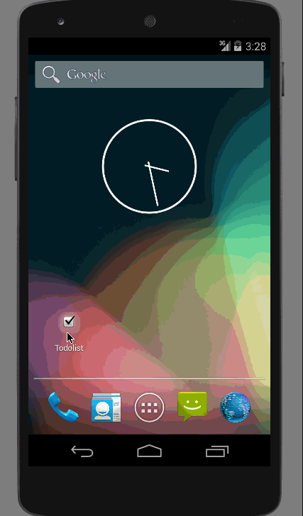

# Todo-Android-App

This is an Android demo application for managing a simple todo list. See the [Android Pre-work: Todo App](http://courses.codepath.com/snippets/intro_to_android/prework) for details.

Time spent: 22 hours spent in total

Completed user stories:
Can you successfully add and remove items from the todo list within your app?
Did you include support for editing todo items as described above?
Does your app persist todo items and retrieve them properly on app restart?

 * [x] Required: User can add and remove items for todo in a list view.
 * [x] Required: User can edit todo items in a new activity.
 * [x] Required: The app persists todo items and retrieves them on re-start.
 * [X] Optional: Tweaked the UI style.
 * [X] Optional: Persisted the todo items into SQLite instead of a text file.
 * [X] Optional: Used a custom layout and adapter.
 * [X] Optional: Added support for due dates, displaying them in listview and editing them in edit activity. Using due date to prioritize items in list.
 

Walkthrough of all user stories:

GIF created with [LiceCap](http://www.cockos.com/licecap/).

